# AYGO-taller1
1. Después de realizado los códigos de LogService y LogFacadeService, con su respectivo 
    front, se les agrega el Dockerfile para poder levantar las instancias en docker,
    para esto se genera un archivo docker-compose.yml, el cual contiene la instancia
    del mongo con la versión mongo:4.2.9-bionic, llamado mongodb, 3 contenedores llamados
    dockercontainer, los cuales se encargan de levantar la instancia del LogService y 
    un último contenedor llamado facadecontainer para levantar la instancia LogFacadeService, 
    que también contiene el front cabe resaltar que el archivo docker-compose.yml está sobre la carpeta raíz que contiene estos
    proyectos para poder acceder a sus respectivos Dockerfile.
2. Cuando se ejecuta el docker-compose up -d, se levantan las instancias como se muestra en la imagen

3. Después de probado el app en local, se crean los repositorios en docker hub
   que van a contener el LogService y el LogFacadeService respectivamente.

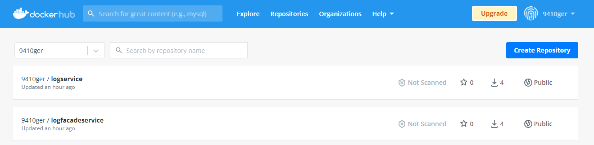

4. Con los repositorios creados, se realiza el proceso de tagear las imagenes previamente
   instanciadas con su respectivo nombre de repositorio

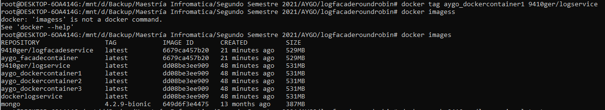

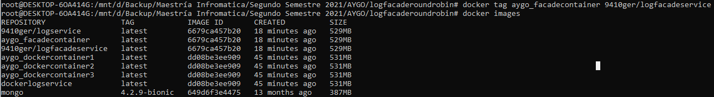

5. Siguiente paso realizar los push respectivos a los repositorios con la anotación ":latest"

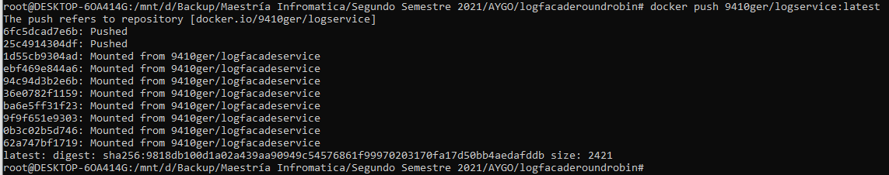

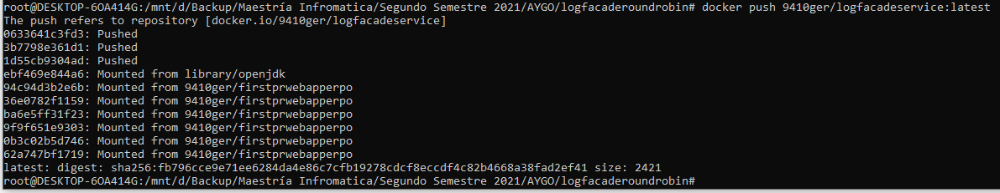

6. Con las imágenes ya subidas en docker hub, se procede a crear la máquina virtual en AWS, se
   una vez levantada se configura el grupo de seguridad para que pueda recibir peticiones por el
   puerto 4000, el cual fue habilitado para que el LogFacadeService reciba información.

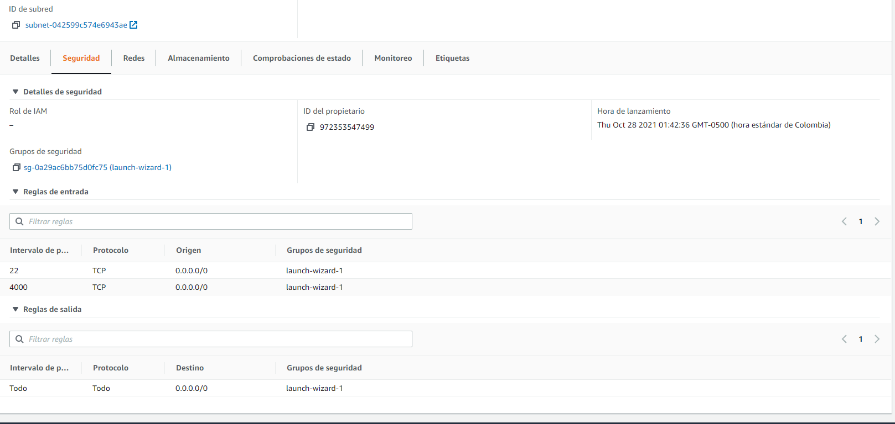

7. Se realiza la instalación de docker en la máquina virtual y también se realiza la instalación del
    comando docker-compose, ya que esta distribución de linux no cuenta con esta instrucción.

8. Se sube el archivo docker-compose.yml en la máquina virtual, pero se le realiza los siguientes cambios:
   1. Para cada uno de los contenedores anteriormente mencionados, tomaban la información del Dockerfile que
      se tenían en local, pero para este caso, se cambia el build y el context:
   
   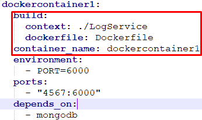
    
   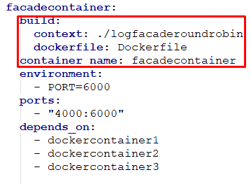
   2. Se cambia por el atribuo image y se apunta al respectivo repositorio en docker hub:
   
    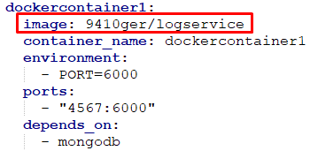
    
    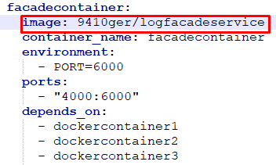
9. Se realiza el docker-compose up -d para levantar las instancias en la máquina virtual
    
    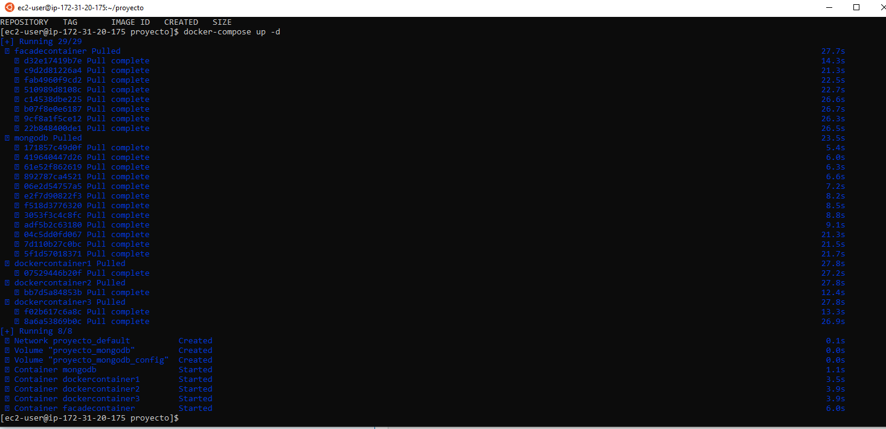
10. Una vez todos los contenedores son instanciados, se prueba la funcionalidad de la app en la ip pública de la máquina
    virtual

    
11. Para finalizar se vuelve a levantar los contenedores con el comando docker-compose up pero sin el tag "-d" para ver
    los prints que realizan el contendor principal y se puede ver que cada vez que se registra un nuevo log el balanceador
    de carga cambia la dirección del contenedor de LogService para realizar su trabajo

    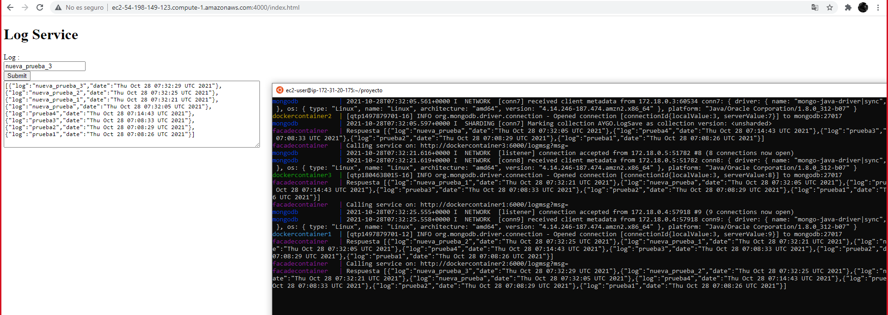
    